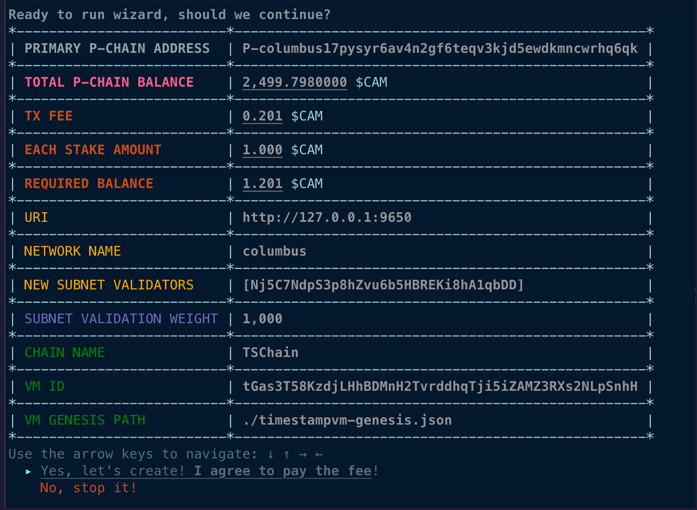
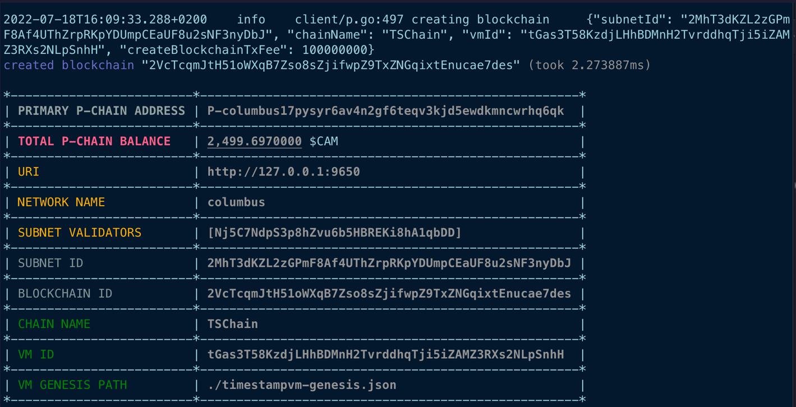
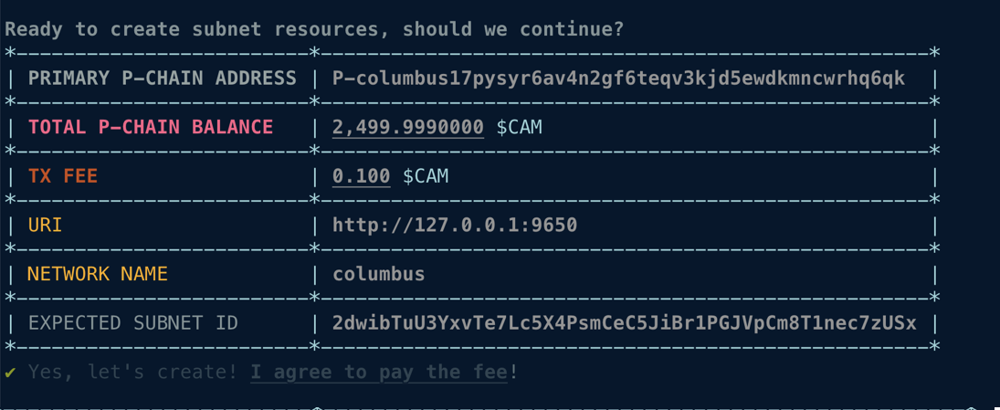
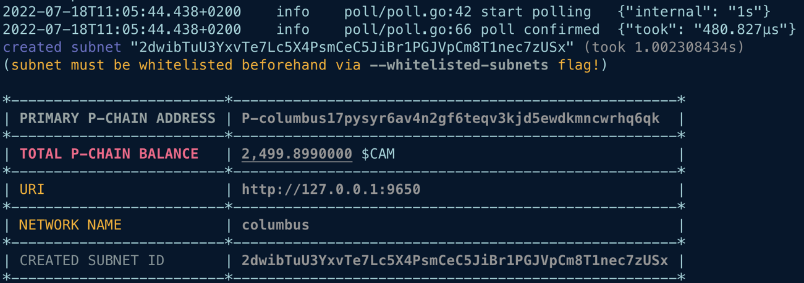
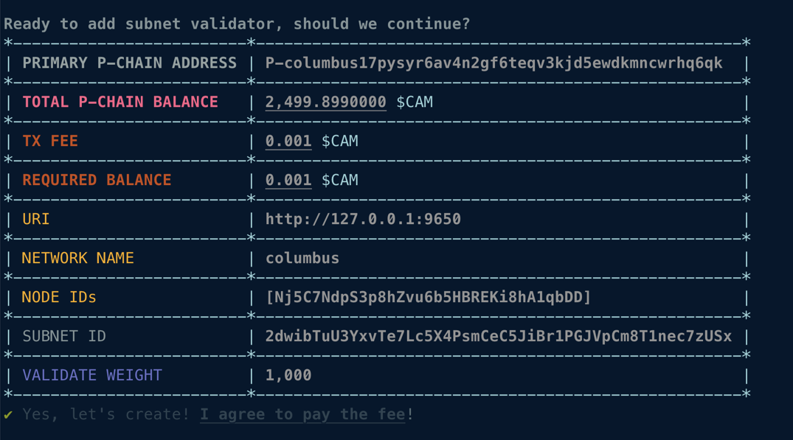
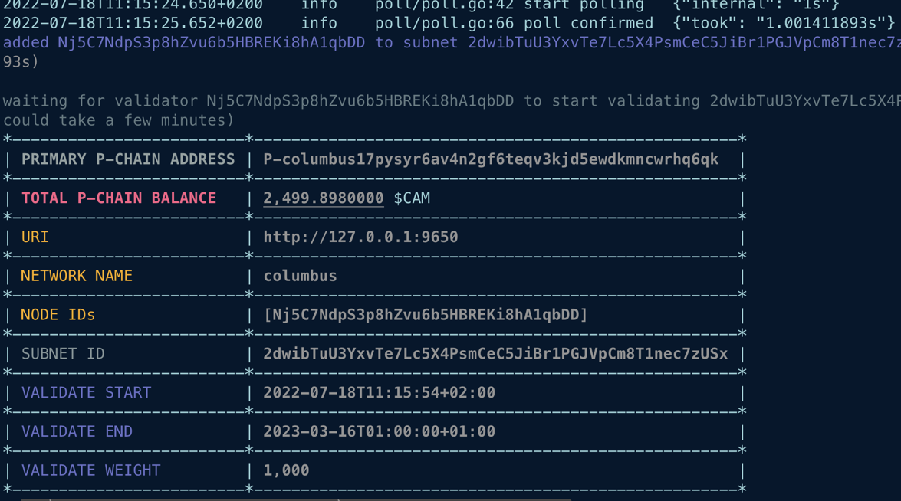
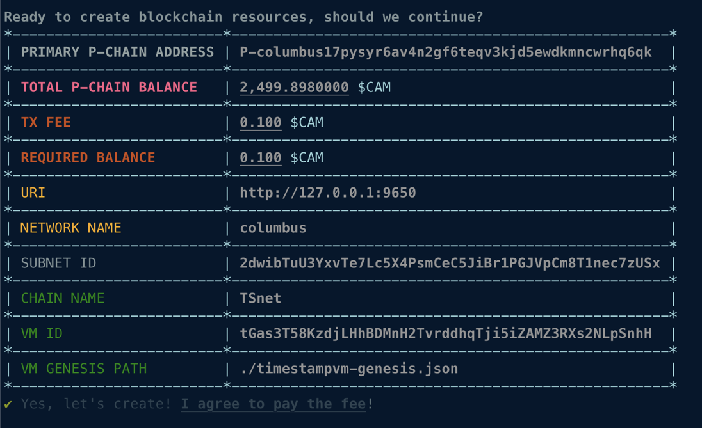
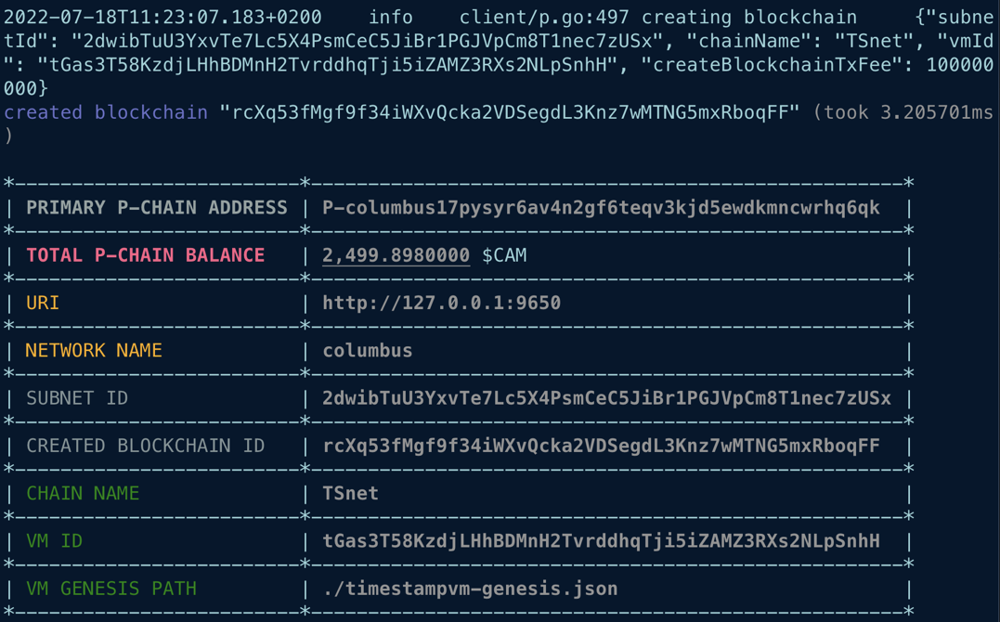

# subnet-cli

A command-line interface to manage [Camino Subnets](https://docs.camino.foundation/subnets/).

## Install

### Source

```bash
git clone https://github.com/chain4travel/camino-subnet-cli.git;
cd camino-subnet-cli;
go install -v .;
```

Once you have installed `subnet-cli`, check the help page to confirm it is
working as expected (_make sure your $GOBIN is in your $PATH_):

### Pre-Built Binaries

```bash
VERSION=0.0.1 # Populate latest here

GOARCH=$(go env GOARCH)
GOOS=$(go env GOOS)
DOWNLOAD_PATH=/tmp/subnet-cli.tar.gz
DOWNLOAD_URL=https://github.com/chain4travel/camino-subnet-cli/releases/download/v${VERSION}/subnet-cli_${VERSION}_linux_${GOARCH}.tar.gz
if [[ ${GOOS} == "darwin" ]]; then
  DOWNLOAD_URL=https://github.com/chain4travel/camino-subnet-cli/releases/download/v${VERSION}/subnet-cli_${VERSION}_darwin_${GOARCH}.tar.gz
fi

rm -f ${DOWNLOAD_PATH}
rm -f /tmp/subnet-cli

echo "downloading subnet-cli ${VERSION} at ${DOWNLOAD_URL}"
curl -L ${DOWNLOAD_URL} -o ${DOWNLOAD_PATH}

echo "extracting downloaded subnet-cli"
tar xzvf ${DOWNLOAD_PATH} -C /tmp

/tmp/subnet-cli -h

# OR
# mv /tmp/subnet-cli /usr/bin/subnet-cli
# subnet-cli -h
```

## Usage

```bash
subnet-cli CLI

Usage:
  subnet-cli [command]

Available Commands:
  add         Sub-commands for creating resources
  completion  Generate the autocompletion script for the specified shell
  create      Sub-commands for creating resources
  help        Help about any command
  status      status commands
  wizard      A magical command for creating an entire subnet

Flags:
      --enable-prompt              'true' to enable prompt mode (default true)
  -h, --help                       help for subnet-cli
      --log-level string           log level (default "info")
      --poll-interval duration     interval to poll tx/blockchain status (default 1s)
      --request-timeout duration   request timeout (default 2m0s)

Use "subnet-cli [command] --help" for more information about a command.
```

### `subnet-cli create VMID`

This command is used to generate a valid VMID based on some string to uniquely
identify a VM. This should stay the same for all versions of the VM, so it
should be based on a word rather than the hash of some code.

```bash
subnet-cli create VMID <identifier> [--hash]
```

### `subnet-cli create key`

```bash
subnet-cli create key
```

This creates a file `.subnet-cli.pk` under the current directory with a private key. By default,
`subnet-cli` uses the key specified in file `.subnet-cli.pk` on the P-Chain to pay for the transaction fee, unless `--private-key-path` is used to overwrite. Please make sure that you have enough funds on this P-Chain address to pay for transactions.

#### Local

On local node funds can be transfered from X-Chain to P-Chain using the following API calls:
- `avm.export`
- `platform.importAVAX`

After following steps, your key should now have a balance on the P-Chain.

### `subnet-cli wizard`

`wizard` is a magical command that:

* Adds all NodeIDs as validators on the primary network (skipping any that
  already exist)
* Creates a subnet
* Adds all NodeIDs as validators on the subnet
* Creates a new blockchain

To create a 4 node subnet:

```bash
subnet-cli wizard \
--node-ids=NodeID-741aqvs6R4iuHDyd1qT1NrFTmsgu78dc4,NodeID-K7Y79oAmBntAcdkyY1CLxCim8QuqcZbBp,NodeID-C3EY6u4v7DDi6YEbYf1wmXdvkEFXYuXNW,NodeID-AiLGeqQfh9gZY3Y8wLMD15tuJtsJHq5Qi \
--vm-genesis-path=fake-genesis.json \
--vm-id=tGas3T58KzdjLHhBDMnH2TvrddhqTji5iZAMZ3RXs2NLpSnhH \
--chain-name=test
```




### `subnet-cli create subnet`

```bash
subnet-cli create subnet
```

To create a subnet in the local network:

```bash
subnet-cli create subnet \
--private-key-path=.insecure.ewoq.key \
--public-uri=http://localhost:57786
```




### `subnet-cli add validator`

```bash
subnet-cli add validator \
--node-ids="[YOUR-NODE-ID]" \
--stake-amount=[STAKE-AMOUNT-IN-NANO-CAM] \
--validate-reward-fee-percent=2
```

To add a validator to the local network:

```bash
subnet-cli add validator \
--private-key-path=.insecure.ewoq.key \
--public-uri=http://localhost:57786 \
--node-ids="NodeID-4B4rc5vdD1758JSBYL1xyvE5NHGzz6xzH" \
--stake-amount=2000000000000 \
--validate-reward-fee-percent=3
```

### `subnet-cli add subnet-validator`

```bash
subnet-cli add subnet-validator \
--node-ids="[YOUR-NODE-ID]" \
--subnet-id="[YOUR-SUBNET-ID]"
```

To add a subnet validator to the local network:

```bash
subnet-cli add subnet-validator \
--private-key-path=.insecure.ewoq.key \
--public-uri=http://localhost:57786 \
--node-ids="NodeID-4B4rc5vdD1758JSBYL1xyvE5NHGzz6xzH" \
--subnet-id="24tZhrm8j8GCJRE9PomW8FaeqbgGS4UAQjJnqqn8pq5NwYSYV1"
```




### `subnet-cli create blockchain`

```bash
subnet-cli create blockchain \
--subnet-id="[YOUR-SUBNET-ID]" \
--chain-name="[YOUR-CHAIN-NAME]" \
--vm-id="[YOUR-VM-ID]" \
--vm-genesis-path="[YOUR-VM-GENESIS-PATH]"
```

To create a blockchain with the local cluster:

```bash
subnet-cli create blockchain \
--private-key-path=.insecure.ewoq.key \
--public-uri=http://localhost:57786 \
--subnet-id="24tZhrm8j8GCJRE9PomW8FaeqbgGS4UAQjJnqqn8pq5NwYSYV1" \
--chain-name=spacesvm \
--vm-id=tGas3T58KzdjLHhBDMnH2TvrddhqTji5iZAMZ3RXs2NLpSnhH \
--vm-genesis-path=/tmp/spacesvm.genesis
```




### `subnet-cli status blockchain`

To check the status of the blockchain `2o5THyMs4kVfC42yAiSt2SrjWNkxCLYZef1kewkqYPEiBPjKtn` from a **private URI**:

```bash
subnet-cli status blockchain \
--private-uri=http://localhost:57786 \
--blockchain-id="X5FJH9b8YGLhakW8GY2vdrKSZxLSN4SeB3tc1kJbKqnwoNQ5L" \
--check-bootstrapped
```

See [`scripts/tests.e2e.sh`](scripts/tests.e2e.sh) and [`tests/e2e/e2e_test.go`](tests/e2e/e2e_test.go) for example tests.
